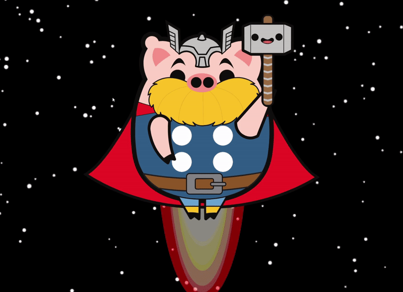

Bienvenue sur mon profil GitHub ! Je suis un développeur passionné par le développement logiciel et les nouvelles technologies. Vous trouverez ici un aperçu de mes projets, compétences et expériences.

## 🌐 Portfolio

Découvrez mon portfolio personnel pour une présentation détaillée de mes projets, compétences et expériences :
[Jonathan Bensadoun Portfolio](https://jonathan-bensadoun.netlify.app/)

## 🚀 Projets

### [Poke-TCGP Actu](https://poke-tcgp-actu.netlify.app/)

**Description**: Poke-TCGP Actu, un site web réalisé pour un streamer Twitch afin de publier des articles sur le jeu mobile TCG Pocket, sorti en octobre.
**technologie**: React,Next,supabase
**Démonstration en direct**:[tgcp](https://poke-tcgp-actu.netlify.app/)

### [Planetarium](https://cosmo-decouverte.netlify.app/)

**Description**: Planetarium, un projet d'exercice visant à explorer les interactions de scroll horizontal et les animations de fond avec l'API Canvas.
**technologie**: React,Next
**Démonstration en direct**:[cosmo](https://cosmo-decouverte.netlify.app/)

### [OstéoVitrine](https://github.com/jonathanbensadoun/Laure_S_web_pages)

**Description**: site web que j’ai réalisé pour une ostéopathe. Ce projet vise à offrir une plateforme conviviale et intuitive permettant aux patients de s’informer sur ses services, ses tarifs, et de réserver des rendez-vous en ligne.
**technologie**: React,Next,framer motion, shadcn
**Démonstration en direct**:[OstéoVitrine](https://github.com/jonathanbensadoun/Laure_S_web_pages)

### [Tool](https://tool-for-dev.netlify.app/)

**Description**: Tool for Dev est une application conçue pour simplifier et améliorer le flux de travail des développeurs en offrant un ensemble d'outils utiles dans un seul environnement. Que vous soyez développeur front-end, back-end, ou full-stack, Tool for Dev vous propose des fonctionnalités adaptées pour gagner en productivité.
**technologie**: React,Next
**Démonstration en direct**:[Tool](https://tool-for-dev.netlify.app/)

### [O'Survivors](https://osurvivors.netlify.app)

**Description**: Un jeu de survie multijoueur en ligne basé sur la survie dans un monde fantasy héroïque.  
**Technologies**: HTML, CSS, JavaScript, React, Redux, NodeJS, Express, Phaser 3.  
**Démonstration en direct**: [O'Survivors](https://osurvivors.netlify.app/)

## 💻 Technologies Utilisées

- HTML
- SCSS
- JavaScript
- TypeScript
- React
- React Native
- Expo
- Supabase
- Firebase
- Redux
- Tailwind CSS
- Vite
- Node.js
- Express.js
- Phaser 3
- next JS
- Three JS

## 📞 Contact

Pour toute demande, veuillez me contacter à :

- **Formulaire contact**: [Contact](https://jonathan-bensadoun.netlify.app/)
- **Email**: [jonathan.ben-sadoun@oclock.school](mailto:jonathan.ben-sadoun@oclock.school)
- **LinkedIn**: [Jonathan Bensadoun](https://www.linkedin.com/in/jonathan-bensadoun/)

## 🎓 Formation

- **2024**: Titre professionnelle Développeur Web & Web Mobile
- **2022** : BTS Management Commerciale Opérationnelle (MCO)

## 🎨 Centres d'intérêt

- **Créativité** : Photographie (portraits, paysages), Dessin, Peinture (aquarelle, acrylique).
- **Manuel** : Bricolage, Menuiserie, Mécanique.
- **Logique** : Jeux de stratégie (Magic: The Gathering).
- Passionné par l'apprentissage continu.

Merci de visiter mon profil GitHub ! N'hésitez pas à me contacter pour discuter de projets, de collaborations ou simplement pour échanger sur les technologies.

---

<!--
**jonathanbensadoun/jonathanbensadoun** is a ✨ _special_ ✨ repository because its `README.md` (this file) appears on your GitHub profile.

Here are some ideas to get you started:

- 🔭 I’m currently working on ...
- 🌱 I’m currently learning ...
- 👯 I’m looking to collaborate on ...
- 🤔 I’m looking for help with ...
- 💬 Ask me about ...
- 📫 How to reach me: ...
- 😄 Pronouns: ...
- ⚡ Fun fact: ...
-->
